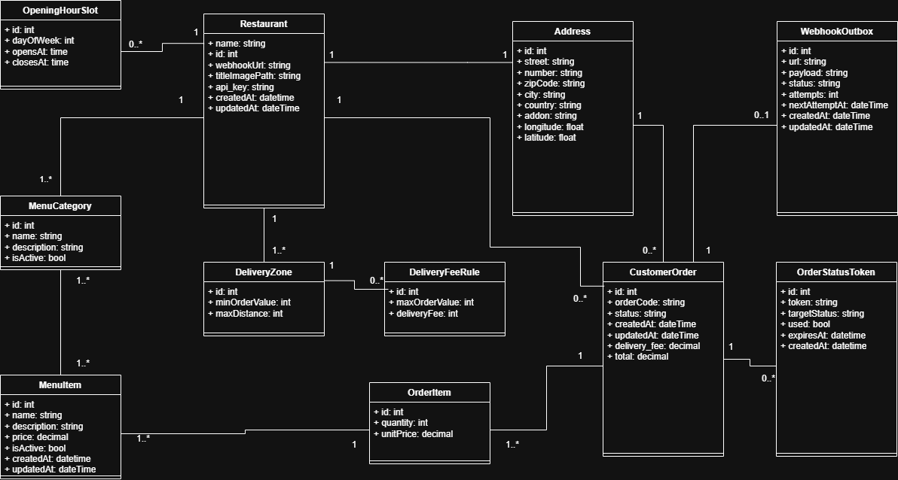
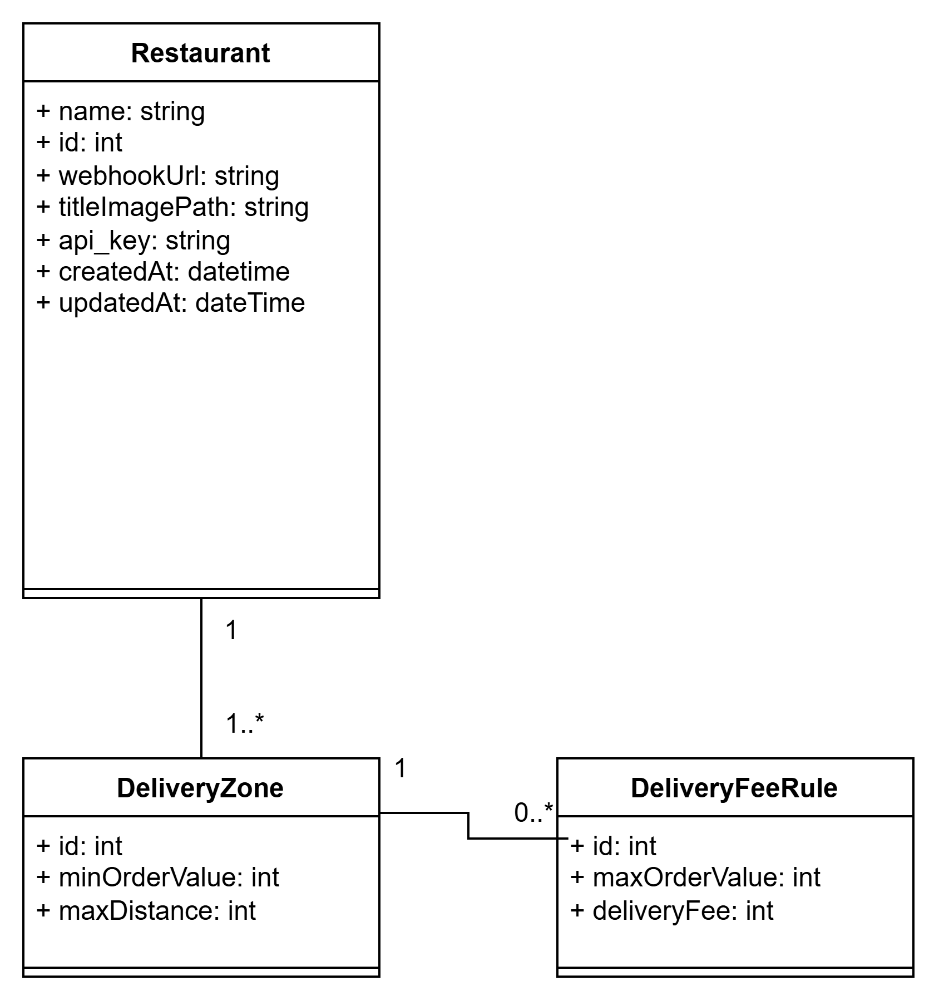

# Dokumentation BITE
### Bestell- und Informationssystem für Takeaway-Essen

#### Das Projekt.
Der Trend, Essen online zu bestellen, ist ungebrochen. Deshalb entwickeln Sie eine App, die alle
derzeit am Markt befindlichen Systeme (zumindest technologisch) alt aussehen lässt. Restaurants veröffentlichen ihre Speisekarte, hungrige Studierende bestellen ihre Lieblingsspeisen. 

## Setup 

#### Starten der Db
Analog zu Übung mit dem Befehl `docker compose up` im Order `/db-sqlserver/`

Dabei werden zwei Datenbanken angelegt: **`BiteDb`** (mit Beispieldaten, von der API genutzt) und **`BiteTestDb`** (leer, nur Schema – die Integrationstests laufen ausschließlich gegen diese und lassen die Beispieldaten unberührt).

## Technischer Aufbau

### Backend: 
Vollständige .NET-Projektstruktur bestehend aus:

  - Bite.Api: ASP.NET Core Web API mit Controllern, DTOs, Mappings und Middleware.
  - Bite.Services: Kapselung der Geschäftslogik (Bestellvorgang, Preisberechnung, Webhooks).
  - Bite.Domain: Zentrales Domänenmodell (Entities und Enums).
  - Bite.Dal: Datenzugriffsschicht (Data Access Objects) basierend auf ADO.NET.
  - Bite.Tests: Umfassende Test-Suite (Unit- und Integrationstests).

### API & Steuerung:
 Implementierte REST-Schnittstellen für Restaurants, Menüs und Bestellungen. Ein GlobalExceptionHandler sorgt für robuste Fehlerantworten, während das ApiKeyAuthAttribute als Filter kritische Endpunkte absichert. (siehe Endpunkte unten bei Frage 2: Workflow)

### Geschäftslogik (Service-Layer):
  - Der Service-Layer validiert komplexe Bestellregeln (Mindestbestellwerte, Lieferzonen via Haversine-Distanzberechnung, Menüabfragen, etc.).
  - Ein Status-Token-System ermöglicht sichere Statusänderungen über zeitlich begrenzte Links ohne Login-Zwang für das Restaurant.

### Zuverlässigkeit (Reliability): 
Implementierung des Outbox-Patterns. Ein asynchroner WebhookOutboxWorker (BackgroundService) garantiert die Zustellung von Bestellungen an Restaurant-Systeme mittels Retry-Logik, auch bei temporären Netzwerkausfällen.

### Datenbank: 
Microsoft SQL Server über Docker Compose mit einem erweiterten Schema für Bestellungen, Webhook-Tracking und Status-Tokens.

### Tests (xUnit, NSubstitute):
  - Integrationstests: Validierung der DAO-Schicht gegen eine echte SQL-Instanz.
  - Unit-Tests: Absicherung der Kernlogik (Preisberechnung, Distanz-Algorithmen, Öffnungszeiten-Checks und Outbox-Verhalten).
  - CI/CD: Automatisierte Pipeline via GitHub Actions für Build und Test-Ausführung.

## Datenbankmodell

  Das erweiterte Schema (identisch in `BiteDb` und der Test-DB `BiteTestDb`) umfasst nun neben den Stammdaten aus Ausbaustufe 1 (Restaurants, Menüs) auch die gesamte Transaktionslogik:
   - CustomerOrder & OrderItem: Speicherung von Bestellungen inkl. historisierter Preise zum Zeitpunkt der Bestellung.
   - OrderStatusToken: Verwaltung von sicheren Einmal-Links für Statusübergänge.
   - WebhookOutbox: Persistente Speicherung von ausgehenden Nachrichten zur Gewährleistung der "At-Least-Once"-Zustellung.
   - Integrität: Foreign Keys und Trigger für automatisierte Zeitstempel. Auto-Increment-IDs genutzt für PK.  

## Testdaten

  Das SQL-Initialisierungsskript erstellt eine realitätsnahe Testumgebung mit verschiedenen Restaurants, komplexen Liefergebühren-Staffelungen (nach
  Distanz und Warenwert) sowie passenden Speisekarten, um die gesamte Logik sofort prüfbar zu machen.

## Fragen aus der Angabe

### 1. Für welches Datenmodell haben Sie sich entschieden? ER-Diagramm, etwaige Besonderheiten erklären: Welche Entscheidungen mussten Sie treffen, wofür (und wogegen) haben Sie sich entschieden und warum?

Wir haben uns für ein relationales SQL-Modell entschieden, da es ACID-Transaktionen und referenzielle Integrität bietet – essenziell für Bestellungen und Preiskalkulationen. 

Zentrale Entscheidungen: Wir haben Adressen normalisiert, um Redundanz zu vermeiden und Geodaten für Routenoptimierung zu ermöglichen. Menüpunkte und -kategorien verknüpften wir über eine Junction-Tabelle m:n, damit ein Gericht mehreren Kategorien zugeordnet werden kann (z.B. Pommes bei Kinderkarte und bei Beilagen). Liefergebühren legten wir staffelbar nach Bestellwert an. Den Bestellstatus begrenzten wir per CHECK-Constraint auf gültige Werte. Für sichere Status-Updates setzen wir Einmal-Token ein, für zuverlässige Webhook-Zustellung das Outbox-Pattern mit Wiederholungslogik.

### 2. Dokumentieren Sie auf Request-Ebene den gesamten Workflow anhand eines durchgehenden Beispiels (von der Registrierung eines Restaurants bis zur Abfrage des Bestellstatus). Sie können ein Tool Ihrer Wahl einsetzen, z. B. Postman Workflows, VS Code, etc. HTTP-Requests inkl. HTTP-Verb, URL, Parametern, Body und Headern.

Der vollständige, ausführbare Workflow – mit allen URLs, Parametern, Bodies und Headern – ist als lesbare HTTP-Datei im Repo hinterlegt: [`Bite/Bite.Api/Bite.Api.http`](Bite/Bite.Api/Bite.Api.http) (ausführbar in Visual Studio bzw. VS Code mit der „REST Client"-Extension). Basis-URL: `http://localhost:5126`; geschützte Requests benötigen den Header `X-Api-Key`.

Kurzerläuterung des durchgängigen Beispiels (Registrierung → Bestellstatus):

1. **POST `/api/Restaurants`** (US 1, multipart/form-data) – Restaurant registrieren. → liefert `restaurantId` + `apiKey` (Key für alle folgenden geschützten Requests).
2. **PUT `/api/Restaurants/{restaurantId}/delivery-conditions`** (US 3, `X-Api-Key`) – Lieferzonen & -kosten festlegen/ersetzen.
3. **PUT `/api/restaurants/{restaurantId}/menu`** (US 4, `X-Api-Key`) – Speisekarte anlegen/ersetzen.
4. **GET `/api/Restaurants?latitude=…&longitude=…&openNow=…&count=…`** (US 5) – Restaurants in der Nähe suchen, (Kundensicht, Hinweis-Designentscheidung: Restaurants, die nicht zum Kunden liefern, werden auch nicht angezeigt).
5. **GET `/api/restaurants/{restaurantId}/menu`** (US 6) – Speisekarte abrufen.
6. **POST `/api/restaurants/{restaurantId}/orders/price`** (US 7) – Preisvorschau inkl. Lieferkosten, im Body befinden sich die Artikel mit denen die Preisvorschau letztendlich dann zu berechnen ist.
7. **POST `/api/restaurants/{restaurantId}/orders`** (US 8) – Bestellung verbindlich aufgeben. → liefert `orderCode`; zusätzlich geht ein Webhook (US 9) an das Restaurant, der die **Status-Änderungs-Links** enthält (je ein einmalig gültiges Token pro Folgestatus).
8. **GET `/api/Orders/{orderCode}/status`** (US 12) – Bestellstatus mithilfe des vorher bekommenen Ordercodes abfragen.
9. **Status ändern** – zwei Wege, beide mit `X-Api-Key`:
   - **PATCH `/api/Orders/{orderCode}`** (US 10) mit Body `{ z.B. "status": "SENT_TO_RESTAURANT" }`, oder
   - **GET `/api/Orders/{orderCode}/status-change/{token}`** (US 11) – Link der im Webhook mitgesandt wurde (Token aus Schritt 7).

   Erlaubte Reihenfolge: `RECEIVED → SENT_TO_RESTAURANT → IN_PREPARATION → OUT_FOR_DELIVERY → DELIVERED` (oder `CANCELLED`); ungültige Sprünge werden mit `422` abgelehnt.
10. **GET `/api/Orders/{orderCode}/status`** – erneute Abfrage zeigt den geänderten Status und schließt somit den Kreis des Workflows.

Datenfluss zwischen den Schritten: `apiKey` ← Schritt 1, `orderCode` ← Schritt 7, `token` ← Webhook (Schritt 7). In der `.http`-Datei laufen die Requests gegen das vorbefüllte Restaurant `id = 1` (Key `nimmersatt-api-key-2026`) und sind damit ohne vorherige Registrierung direkt ausführbar.

### 3. Wie stellen Sie sicher, dass manche Requests nur mit einem gültigen API-Key aufgerufen werden können?

Wir haben einen **zentralen Authentifizierungsmechanismus** in Form eines **`ApiKeyAuthAttribute`** implementiert, das als **IAsyncAuthorizationFilter** fungiert. Dieser wird bei allen geschützten Endpunkten über das `[ApiKeyAuth]`-Attribut deklariert (z. B. bei `PATCH /api/Orders/{orderCode}` oder `PUT /api/Restaurants/{id}/menu`).

Der Ablauf im Detail: Der API-Key wird aus dem **HTTP-Header `X-Api-Key`** ausgelesen – nicht aus dem Body, da dies der REST-Konvention entspricht und die Header-Ebene für Authentifizierungsdaten vorgesehen ist. Der Key wird dann über den `IApiKeyService` **gehasht** und mit dem in der Datenbank gespeicherten Hash abgeglichen. Existiert das Restaurant, wird dessen `Id` im `HttpContext.Items`-Dictionary hinterlegt, sodass nachgelagerte Controller-Methoden den authentifizierten Restaurant-Kontext nutzen können (z. B. zur Autorisierung, dass ein Restaurant nur eigene Bestellungen oder sein eigenes Menü ändert). Fehlt der Key oder ist er ungültig, antwortet der Filter sofort mit **401 Unauthorized**, ohne dass die Controller-Logik erreicht wird. So stellen wir sicher, dass geschützte Routen ausschließlich für authentifizierte Restaurants zugänglich sind – eine zusätzliche Berechtigungsprüfung verhindert zudem den Zugriff auf fremde Ressourcen.

### 4. Bei welchen Teilen Ihres Systems ist eine korrekte Funktionsweise aus Sicht von BITE am wichtigsten? Welche Maßnahmen haben Sie getroffen, um sie zu gewährleisten?

Im Prinzip ist natürlich alles wichtig, da sobald eine der oben im Workflow genannten Schritte nicht zusammenspielt, wir Ausfälle / unzufriedene Kunden haben. 
Am wichtigsten sind dennoch sicher korrekte Preisabfragen und das Bestellsystem für bestehende Restaurants. Alles rund um das erstellen / erfassen eines Orders ist essenziell wichtig um bestehende  Kunden zu bewahren. Wenn bspw. das Ändern des Statuses bzw. die Anzeige des Statuses kurz ausfällt, ist das ärgerlich für alle Beteiligten, hindert die Restaurants aber jetzt nicht daran, aktiv Geld durch unsere App zu verdienen, was letztendlich eines der primären Ziele eines solchen Systems ist. 
Getroffene Maßnahmen: 
  1. Transaktionsschutz: Nutzung von Datenbank-Transaktionen, um Datenkonsistenz bei jeder Bestellung zu garantieren.
  2. Resilienz durch Outbox-Pattern: Ein asynchroner Worker mit Retry-Logik stellt sicher, dass Restaurant-Benachrichtigungen auch bei kurzen
  Netzwerkausfällen zuverlässig ankommen.
  3. Umfassende Unit-Tests: Besonders für die  Preislogik, Distanzberechnungen und Öffnungszeiten wurden automatisierte Tests implementiert, um unvorhersehbare Probleme zu vermeiden.
  4. Zentrales Exception-Handling: Ein globaler Handler stellt die Verfügbarkeit der API sicher und verhindert unkontrollierte Abstürze.

### 5. Wie stellen Sie sicher, dass ihre API bei der Berechnung des Gesamtpreises für eine Bestellung inkl. Lieferkosten in allen Fällen ein korrektes Ergebnis liefert?
  Wir haben einen ausgelagerten OrderService, der sich um die Preiskalkulation kümmert. Diesen haben wir wie folgt abgesichert:

  1. **Zentralisierung der Geschäftslogik** (Single Source of Truth):
  Die gesamte Preislogik ist im OrderService gekapselt. Das bedeutet, egal ob ein Kunde vorab den Preis anfragt (CalculatePriceAsync) oder die
  Bestellung final aufgibt (PlaceOrderAsync), es wird intern immer dieselbe Methode ValidateOrderAsync aufgerufen. Dies verhindert, dass sich
  Berechnungsunterschiede zwischen "Vorschau" und "echter Bestellung" einschleichen.

  2. **Schutz vor Manipulation** (Server-side Calculation):
  Wir vertrauen niemals den Preisen, die vom Frontend gesendet werden könnten. Der Client sendet nur die IDs der Menüpunkte. Der OrderService lädt
  die aktuell gültigen Preise für jedes Item frisch aus der Datenbank. So ist sichergestellt, dass ein Kunde den Preis nicht manipulieren kann,
  indem er die Anfrage lokal abändert.

  3. **Mehrstufige Validierungskette**:
  Die Berechnung folgt einem strikten Prozess, bei dem jeder Schritt validiert wird:
   * Item-Check: Es wird geprüft, ob die Artikel zum gewählten Restaurant gehören und ob sie aktuell aktiv sind.
   * Geografische Distanz: Mithilfe der GeoUtils (Haversine-Formel) berechnen wir die Luftlinie zwischen Restaurant und Lieferadresse.
   * Zonenzuordnung: Das System sucht basierend auf der Distanz die passende Lieferzone. Hierbei wird auch geprüft, ob der Mindestbestellwert der Zone erreicht wurde.
   * Staffelung der Liefergebühren: Innerhalb der Zone werden die DeliveryFeeRules angewendet. Diese erlauben komplexe Regeln (z.B. "0-20€: 5€
     Gebühr", "20-50€: 2€ Gebühr", "ab 50€: kostenfrei").

  4. **Absicherung durch automatisierte Tests** (Unit Tests):
  Um sicherzustellen, dass die Berechnung "in allen Fällen" korrekt ist, haben wir eine umfangreiche Testsuite in OrderServiceCalculatePriceTests.cs
  implementiert. Diese deckt zahlreiche Szenarien ab:
     * Standardbestellungen in verschiedenen Zonen.
     * Grenzfälle (Edge Cases), wie z.B. Bestellungen exakt am Schwellenwert für kostenlose Lieferung.
     * Fehlerszenarien (Adresse außerhalb des Liefergebiets, Mindestbestellwert nicht erreicht, inaktive Artikel).
     * Mathematische Korrektheit der Distanzberechnung durch separate Tests für die GeoUtils.

  Durch diese Kombination aus zentraler Logik, Datenbank-Validierung und einer hohen Testabdeckung stellen wir sicher, dass die API auch bei
  komplexen Gebührenmodellen stets ein verlässliches und korrektes Ergebnis liefert.

 

### 6. Welche Maßnahmen haben Sie getroffen, um sicherzustellen, dass alle Bestellungen tatsächlich beim Restaurant ankommen, auch wenn dessen API kurzfristig nicht erreichbar ist?

 Um die Zuverlässigkeit der Benachrichtigungen zu garantieren, haben wir das Outbox Pattern implementiert. Dies verhindert den Verlust von
  Bestellungen durch Netzwerkfehler oder kurzzeitige Ausfälle der Restaurant-Systeme.

  Die Umsetzung im Detail:

   1. **Atomarität durch Transaktionen:**
      Wenn eine Bestellung aufgegeben wird (OrderService.PlaceOrderAsync), wird der Benachrichtigungs-Auftrag (Webhook-Payload) zusammen mit der
  Bestellung in derselben Datenbank-Transaktion gespeichert. Das bedeutet: Entweder wird beides gespeichert oder gar nichts. Es kann also niemals
  passieren, dass eine Bestellung in der Datenbank existiert, aber kein Zustellungsversuch in der "Outbox" (Ausgangskorb) hinterlegt wurde.

   2. **Entkopplung durch Hintergrundverarbeitung:**
      Die eigentliche HTTP-Anfrage an das Restaurant erfolgt nicht direkt während des Bestellvorgangs, sondern asynchron durch den
  WebhookOutboxWorker. Dies ist ein spezialisierter Hintergrunddienst (BackgroundService), der ständig die Datenbank nach neuen oder noch nicht
  zugestellten Einträgen durchsucht.

   3. **Intelligente Retry-Logik (Wiederholungsstrategie):**
      Sollte die API des Restaurants zum Zeitpunkt der Bestellung nicht erreichbar sein (z.B. HTTP 500 oder Timeout), markiert der Worker den
  Eintrag nicht als Fehler, sondern plant ihn für einen späteren Zeitpunkt neu ein. Wir nutzen hierfür eine definierte Strategie mit steigenden
  Wartezeiten (RetryDelaysSeconds):
       * Sofortiger Versuch, dann nach 2, 5, 15, 30 und schließlich 60 Sekunden.
       * Erst wenn alle Versuche fehlschlagen, wird die Benachrichtigung final als "Failed" markiert, damit sie manuell geprüft werden kann.

   4. **Persistenz:**
      Da die Outbox-Einträge in der SQL-Datenbank gespeichert sind, gehen keine Benachrichtigungen verloren, selbst wenn unser eigener API-Server
  einmal neu gestartet werden muss. Nach dem Neustart nimmt der WebhookOutboxWorker einfach dort wieder auf, wo er aufgehört hat.

   5. **Status-Synchronisation:**
      Erst wenn der WebhookSender eine erfolgreiche Rückmeldung (HTTP 2xx) vom Restaurant erhält, wird der Status der Bestellung in unserer
  Datenbank von RECEIVED auf SENT_TO_RESTAURANT aktualisiert. So haben wir jederzeit im Blick, welche Bestellungen bereits erfolgreich übermittelt
  wurden.

### 7. Ein Restaurant behauptet, keine Bestellungen übermittelt zu bekommen. Wie analysieren Sie das Problem?

 Um dieses Problem zu lösen, würden wir eine strukturierte Fehlersuche in vier Schritten durchführen:

  1. **Datenbank-Check** (Die WebhookOutbox-Tabelle):
  Zuerst prüfen wir in der Datenbank den Status der Benachrichtigungen für dieses spezifische Restaurant.
   * Gibt es Einträge? Wenn keine Einträge vorhanden sind, liegt das Problem bereits beim Bestellvorgang (z.B. Bestellung wurde gar nicht erst
     abgeschlossen).
   * Was ist der Status?
       * Stehen Einträge auf Pending? Dann arbeitet der WebhookOutboxWorker vielleicht gerade nicht oder ist überlastet.
       * Stehen Einträge auf Failed? Dann hat unser System es mehrfach versucht, aber das Restaurant-System hat die Annahme verweigert.
       * Stehen sie auf Sent? Dann wurde die Bestellung erfolgreich an die hinterlegte URL übermittelt, und das Problem liegt wahrscheinlich intern
         beim Restaurant.

  2. **Überprüfung der Konfiguration:**
  Wir kontrollieren in der Tabelle Restaurants, ob die hinterlegte WebhookUrl korrekt ist. Oft führen Tippfehler (z.B. http statt https oder ein
  falscher Port) dazu, dass die Pakete ins Leere laufen.

  3. **Analyse der Server-Logs:**
  Wir würden die Logs unseres WebhookOutboxWorker durchsuchen. Unser Code loggt spezifische Fehler:
   * Suche nach: "Outbox {Id} permanently failed for order {OrderId}".
   * Hier sehen wir auch, welche HTTP-Statuscodes das Restaurant zurückgegeben hat (z.B. 403 Forbidden oder 404 Not Found). Dies gibt einen direkten
     Hinweis darauf, ob z.B. eine Authentifizierung beim Restaurant fehlt oder der Endpunkt falsch benannt ist.

  4. **Manuelle Simulation (Integrationstest):**
  Sollten die Logs keine klaren Schlüsse zulassen, würden wir versuchen, den Webhook manuell (z.B. via Postman oder curl) von unserem Server aus
  aufzurufen. Damit können wir feststellen, ob es eventuell Netzwerk- oder Firewall-Einschränkungen gibt, die die Kommunikation zwischen unserer Cloud
  und dem Restaurant-Server blockieren.

  Durch das Outbox-Pattern haben wir den großen Vorteil, dass wir eine "Historie" der Zustellversuche in der Datenbank haben. Wir
  müssen nicht raten, sondern können anhand der Spalten Attempts, LastAttempt und des Status genau sagen, wann und warum eine Übermittlung
  gescheitert ist.

### 8. Wie haben Sie sichergestellt, dass die Lieferbedingungen (Mindestpreis und Versandbedingungen) möglichst einfach erweiterbar sind? Beispielsweise könnten die Versandkosten von der Postleitzahl abhängig werden. Beschreiben Sie die relevanten Stellen des Designs (Klassen-Diagramm).

Unser Design basiert auf einer klaren Trennung zwischen geografischen Bedingungen (Wo wird geliefert?) und preislichen Bedingungen (Was kostet es
  dort?). Dies haben wir durch zwei zentrale Entitäten gelöst:

  1. Relevante Stellen des Designs (Datenmodell):
     * DeliveryZone: Definiert den räumlichen Geltungsbereich. Aktuell nutzt diese Klasse das Attribut MaxDistance (Luftlinie) und einen
     MinOrderValue.
     * DeliveryFeeRule: Ist einer Zone zugeordnet und erlaubt eine Staffelung der Lieferkosten basierend auf dem Warenkorbwert (z.B. "ab 50€
     versandkostenfrei"). Durch die 1:N-Beziehung zwischen Zone und Regeln können beliebig viele Preisstufen pro Gebiet definiert werden.

  2. Erweiterbarkeit am Beispiel der Postleitzahl (PLZ):
  Um das System von einer reinen Distanzberechnung auf PLZ-basierte Kosten umzustellen (oder beides zu kombinieren), sind nur minimale Änderungen
  nötig:

     * Erweiterung der Entität DeliveryZone: Wir würden der Tabelle/Klasse ein optionales Attribut ZipCode (oder eine Liste von PLZ) hinzufügen.
     * Anpassung der Auswahl-Logik: Im OrderService (Methode ValidateOrderAsync) wird aktuell nach der Distanz gefiltert. Diese Logik ließe sich
     einfach erweitern:
         * Bisher: WHERE distance <= MaxDistance
         * Neu (flexibel): WHERE (ZipCode IS NULL OR ZipCode = @UserZip) AND (MaxDistance IS NULL OR distance <= MaxDistance)
     * Flexible Kriterien: Durch das Hinzufügen weiterer (nullable) Spalten in DeliveryZone (z.B. City, District oder sogar DayOfWeek) kann das System
     zu einem regelbasierten "Einrelationenmodell" für die Gebietsbestimmung ausgebaut werden, ohne die Grundstruktur der Preisregeln
     (DeliveryFeeRule) ändern zu müssen.

  3. Vorteile dieses Designs:
     * Kein Code-Eingriff bei Preisänderungen: Restaurants können ihre Liefergebühren und Zonen jederzeit über z.B. ein späteres
     Admin-UI anpassen, ohne dass die API neu kompiliert werden muss.
     * Granularität: Da die DeliveryFeeRule vom Warenwert abhängt, können komplexe Marketing-Aktionen (z.B. "Gratis-Lieferung am Wochenende ab 30€")
     allein durch Datenkonfiguration abgebildet werden.

  Das Design ist so gewählt, dass die Ermittlung der Zone (die Geografie) streng von der Berechnung der Gebühr (die Preisstaffel)
  getrennt ist. Jede neue Bedingung (wie die PLZ) erfordert lediglich ein neues Attribut in der DeliveryZone, während die restliche
  Kalkulationslogik stabil bleibt.

### 9. Denken Sie an die Skalierbarkeit Ihres Projekts: Plötzlich verwenden tausende Restaurants und zehntausende Studierende das Produkt. Was macht Ihnen am meisten Kopfzerbrechen?

Abgesehen von der reinen Server-Infrastruktur bereiten uns vor allem drei Punkte in der Software-Architektur Kopfzerbrechen, wenn das System massiv wächst:

**1. Datenbank-Verbindungsmanagement als primärer Flaschenhals**

Aktuell wird für fast jede Datenbank-Operation eine neue Verbindung geöffnet.

**Das Problem:**
Das Öffnen einer physischen Verbindung zur Datenbank ist aufwendig, da dabei unter anderem ein TCP-Handshake und eine Authentifizierung stattfinden. Bei Zehntausenden gleichzeitigen Anfragen würde der Datenbank-Server mehr Zeit damit verbringen, Verbindungen zu verwalten, als Abfragen zu verarbeiten. Dadurch könnte es zu einer sogenannten „Connection Pool Exhaustion“ kommen: Anfragen müssten warten, bis eine Verbindung frei wird, was wiederum massive Timeouts verursachen würde.

**Lösungsansatz:**
Wir müssten ein striktes Connection Pooling konfigurieren und sicherstellen, dass Verbindungen so kurz wie möglich gehalten werden. Zusätzlich wäre der Einsatz von Caching, zum Beispiel mit Redis, für Restaurant-Metadaten und Menüs essenziell, um die Anzahl der Datenbankzugriffe pro Request drastisch zu reduzieren.

**2. Datenbank-Contention durch Schreibzugriffe auf zentrale Tabellen**

In unserem System gibt es Tabellen, in die sehr häufig geschrieben wird, insbesondere die Tabellen `CustomerOrder` und `WebhookOutbox`.

**Das Problem:**
Bei Tausenden Bestellungen pro Minute entstehen die berüchtigte Lock-Conditions in der Datenbank. Wenn der `WebhookOutboxWorker` ständig Zeilen liest und als „gesendet“ markiert, während gleichzeitig neue Bestellungen eingefügt werden, kann es zu Deadlocks oder langen Warteschlangen kommen.

**Lösungsansatz:**
Wir müssten hier auf eine Read-Write-Splitting-Architektur umsteigen, bei der Lesezugriffe über Read-Replicas erfolgen und Schreibzugriffe über einen Master laufen.

**3. Der Outbox-Worker als Singleton-Bottleneck**

Aktuell läuft der `WebhookOutboxWorker` als einzelner Hintergrunddienst innerhalb der API.

**Das Problem:**
Ein einzelner Worker verarbeitet die Einträge sequenziell oder nur in kleinen Batches. Wenn Zehntausende Bestellungen eingehen, kommt ein einzelner Prozess nicht mehr hinterher, die Webhooks zeitnah zu versenden. Die Zustellung an die Restaurants würde sich dadurch immer weiter verzögern.

**Lösungsansatz:**
Der Worker müsste horizontal skalierbar gemacht werden. Das bedeutet, dass mehrere Instanzen des Workers gleichzeitig laufen können müssten, ohne dieselbe Bestellung doppelt zu verarbeiten. Dies könnte beispielsweise durch Pessimistic Locking oder eine Status-Queue umgesetzt werden.

**Fazit:**
Das größte Kopfzerbrechen bereitet uns die starke Zentralisierung auf die SQL-Datenbank. Für ein System dieser Größe müssten wir den monolithischen Datenbank-Ansatz aufbrechen und für hochfrequente Aufgaben, wie die Outbox-Verarbeitung oder das Session-Management, auf spezialisierte, verteilte Systeme umsteigen.

### 10. Haben Sie im Zuge der Projektarbeit Erfahrungen mit dem Einsatz von KI-Agenten zur Generierung von Sourcecode gesammelt? Welche? Was hat gut funktioniert, wo sind Sie gescheitert?

Wir haben im Rahmen der Projektarbeit KI-Werkzeuge (insbesondere ChatGPT, Claude, Gemini) im Frage-Modus eingesetzt.

Konkret nutzten wir KI für Bereiche mit hohem Boilerplate-Anteil, etwa grundlegende CRUD-Operationen, DTO-Mappings und Validierungslogik. Auch bei der Erstellung von Testdaten und Seed-Skripten sowie beim Debugging komplexer Fehlermeldungen (z. B. LINQ-Ausdrücke) war die KI hilfreich.

Gut funktioniert hat die schnelle Bereitstellung strukturierter Code-Grundgerüste und die Erklärung von Framework-Konzepten wie ASP.NET Core Middleware oder Webhook-Konzepten. 

Gescheitert sind wir hingegen bei domänenspezifischen Geschäftslogiken wie der korrekten Staffelung von Liefergebühren oder dem Outbox-Pattern – hier lieferte die KI oberflächliche Lösungen ohne Verständnis für unseren Architekturkontext, da es auch nicht möglich war ausreichend Dateien hochzuladen, um ihm den notwendigen Kontext zu geben.

### 11. Wenn Sie das Projekt neu anfangen würden – was würden Sie anders machen?

Rückblickend würden wir einige Entscheidungen anders treffen. Zunächst würden wir mehr Zeit in die initiale Architektur- und API-Schnittstellendefinition investieren. Gerade bei der Kommunikation zwischen den einzelnen Modulen (z. B. zwischen Restaurant-, Menü- und Order-Service) haben wir im Laufe des Projekts wiederholt Anpassungen vornehmen müssen, weil Abhängigkeiten nicht ausreichend durchdacht waren.

Auch beim Datenmodell würden wir uns m:n Beziehungen genauso wie soft_deletes besser überlegen, da das im Laufe des Entwicklungsprozesses immer wieder zu Problemen geführt hat.

Was uns bei dem Projekt konkret nicht möglich war, da wir die Technologie von REST erst später gelernt haben, aber es wäre sicher auch hilfreich gewesen zu überlegen, welche Schnittstellen benötigt werden und auch diese Information in das Design der Backends von Anfang an miteinfließen zu lassen

Zu guter Letzt würden wir mehr automatisierte Tests von Anfang an schreiben. Unit-Tests für die Geschäftslogik und Integrationstests für die Datenbankzugriffe kamen im Projektverlauf zu kurz und wurden erst später nachgeholt – das führte zu unnötigem manuellem Testaufwand bei Änderungen. Wir glauben eine Anlehnung an TDD hätte uns durchaus manche Zeit erspart. 

Zusammenfassend: Wir würden Architektur und Schnittstellen gründlicher vorab definieren, das Datenmodell flexibler gestalten, ein konsistentes Fehlerhandling etablieren und Testautomatisierung von Beginn an priorisieren.