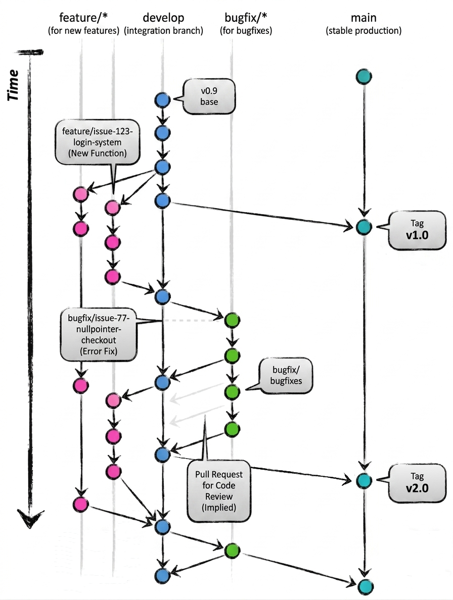

# Git Branching Model

## Überblick

Dieses Dokument beschreibt ein einfaches und sauberes Branching-Modell für dieses Projekt.

---

# 🌿 Branch-Struktur

## 🟢 main

* Stabiler Produktions- bzw. Release-Branch
* Enthält nur getesteten und fertigen Code
* Hier werden Milestones getaggt (z. B. v1.0, v2.0)

## 🔵 develop

* Integrationsbranch für laufende Entwicklung
* Hier werden alle fertig entwickelten Features zusammengeführt
* Grundlage für neue Feature-Branches

## 🌱 feature/*

* Für neue Funktionen
* Werden von `develop` abgezweigt
* Beispiel:

  * feature/issue-123-login-system
  * feature/issue-45-order-api

## 🐛 bugfix/*

* Für Fehlerbehebungen
* Ebenfalls von `develop` abgezweigt
* Beispiel:

  * bugfix/issue-77-nullpointer-checkout

---

# 🔄 Workflow

1. Issue auswählen
2. Branch von develop erstellen
3. Implementieren
4. Pull Request erstellen → develop
5. Code Review
6. Merge nach Approval

---

# 🚀 Release-Prozess (Milestones)

* `develop` wird stabilisiert
* Merge: `develop → main`
* Tag setzen: v1.0, v2.0
* `main` bleibt jederzeit stabil

---

# ⚠️ Wichtige Regeln

* Kein direkter Commit auf `main`
* Alles läuft über Pull Requests
* `main` muss immer lauffähig bleiben
* Kleine, klare Feature-Branches bevorzugen

---

# 🖼️ Darstellung


---

# 🧰 Git – Cheat Sheet

## 📦 Repository Status

```bash
git status
```

Zeigt geänderte, neue oder gelöschte Dateien

---

## 📥 Updates holen

```bash
git pull origin develop
```

Aktualisiert lokalen Branch mit Remote-Version

---

## 🌱 Feature Branch erstellen

```bash
git checkout develop
git checkout -b feature/issue-XYZ-name
```

---

## 🐛 Bugfix Branch erstellen

```bash
git checkout develop
git checkout -b bugfix/issue-XYZ-name
```

---

## 💾 Änderungen speichern

```bash
git add .
git commit -m "message"
```

---

## 🚀 Branch hochladen

```bash
git push -u origin feature/issue-XYZ-name
```

---

## 🔄 Nach PR Merge: lokal aktualisieren

```bash
git checkout develop
git pull origin develop
```

---

## 🧹 Branch löschen (lokal)

```bash
git branch -d feature/issue-XYZ-name
```

---

## 🧹 Branch löschen (remote)

```bash
git push origin --delete feature/issue-XYZ-name
```

---

## 🏷️ Release Tag setzen

```bash
git checkout main
git merge develop
git tag v1.0
git push origin main --tags
```

---
